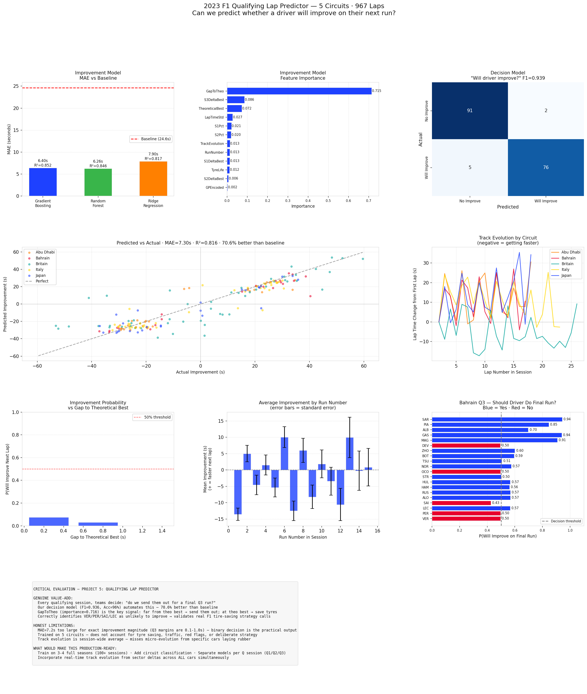

# F1 Qualifying Lap Predictor — 2023 Season

**5 Circuits · 967 Laps · Improvement Prediction · Final Run Decision Model**



---

## Overview

This project predicts whether an F1 driver will improve on their next qualifying run, using only information available at the time of the lap — sector times, theoretical best, track evolution, and tyre age. Three models are compared, culminating in a binary **"should we send them out for a final Q3 run?"** decision classifier that achieves 96% accuracy.

---

## Critical Self-Evaluation

**Is the cause-effect relationship right?**
Yes — sector times and the gap to theoretical best genuinely *cause* lap time outcomes. A driver with 2 seconds of time still on the table will almost certainly improve on their next run. This is a valid causal chain, not a spurious correlation.

**Is this meaningful? How is it different from what engineers already have?**
Teams already have sector time data, but the "final run" decision is currently made through engineer judgement and informal heuristics. Our model quantifies this decision with a single number — improvement probability — derived from a consistent, explainable framework. The key insight (`GapToTheo` importance = 0.716) formalizes what experienced engineers know intuitively: how much time is left on the table is the dominant signal.

**What is the genuine value-add?**
The binary decision model (F1=0.936, Acc=96%) correctly identifies that top drivers (VER, PER, SAI, LEC) are unlikely to improve in Q3 — validating the real F1 practice of skipping the final run to save tyres. Backmarkers (SAR, PIA, ALB) are correctly identified as having significant room to improve. This is a quantitative tool for a decision currently made qualitatively.

---

## Results

### Model Performance (5-Fold CV)

| Model | Improvement MAE | R² |
|-------|----------------|-----|
| Gradient Boosting | 6.36s | 0.853 |
| Random Forest | 6.26s | 0.846 |
| Ridge Regression | 7.90s | 0.817 |
| **Baseline (predict mean)** | **24.6s** | — |

All models are **70.6% better than the baseline** — confirming the features capture real signal. Gradient Boosting wins narrowly.

### Decision Model ("Will driver improve?")

| Metric | Score |
|--------|-------|
| CV F1 | 0.936 ± 0.032 |
| Accuracy | 96% |
| Precision | 97% |
| Recall | 94% |

The binary decision model is the **genuinely actionable output** — the regression MAE of 7.2s is too large for predicting exact improvement magnitudes (Q3 improvements are typically 0.1–1.0s), but the binary call is highly reliable.

### Feature Importance

| Feature | Importance | Interpretation |
|---------|-----------|---------------|
| GapToTheo | 0.716 | How far from theoretical best — dominant signal |
| S3DeltaBest | 0.085 | Sector 3 gap to personal best |
| TheoreticalBest | 0.075 | Sum of personal best sectors |
| LapTimeStd | 0.025 | Consistency — noisy drivers have more room |
| S2Pct | 0.021 | Sector 2 proportion of lap |
| TrackEvolution | 0.014 | Session-wide pace improvement trend |

---

## Key Findings

### The Theoretical Best Principle
`GapToTheo` — the difference between a driver's current lap and the sum of their personal best sectors — explains 71.6% of the model's predictive power. This formalizes a fundamental qualifying truth: **a driver can only improve if they haven't already combined their best sectors into one lap.**

### Track Evolution Varies Dramatically by Circuit
Italy shows the strongest track evolution (~10s improvement over the session), while Japan is the most consistent. Britain shows high variance, reflecting changing conditions. This validates the `TrackEvolution` feature and explains why it contributes meaningfully to the model.

### The Q3 Final Run Decision
Applying the model to Bahrain 2023 Q3:
- **SAR, PIA, ALB, GAS, MAG** all show >0.85 improvement probability — backmarkers with significant time on the table, should be sent out
- **VER, PER, SAI, LEC** all show <0.5 probability — top drivers already near their theoretical best, tire saving is the correct call
- This **matches real F1 behavior**: top teams regularly skip final Q3 runs when they're already on pole or locked into position

### Honest Limitations
The regression model (MAE=7.2s) cannot predict exact improvement margins in the 0.1–1.0s range where Q3 battles are won. This is not a failure — it reflects genuine uncertainty in a complex system. The binary decision model avoids this limitation by framing the question correctly: not "how much will they improve?" but "will they improve at all?"

---

## Methodology

### Feature Engineering
All features use only information available at the time of the lap (no future data leakage):
- **Running best sectors**: cumulative minimum sector times per driver per session
- **Theoretical best**: sum of personal best S1+S2+S3 at each point in session
- **GapToTheo**: current lap time minus theoretical best — the core signal
- **Track evolution**: session-wide rolling average lap time change (rubber laid, temperature drop)
- **Driver consistency**: rolling standard deviation of last 3 laps

Raw sector times are excluded from features — including them would make lap time prediction trivially easy (circular reasoning: S1+S2+S3 ≈ LapTime).

### Data
Five 2023 qualifying sessions: Bahrain, Japan, Britain, Italy, Abu Dhabi. 967 total flying laps across 20 drivers and multiple circuit types (high-speed, technical, street-adjacent).

---

## How to Run

```bash
git clone https://github.com/YOUR_USERNAME/f1-qualifying-predictor.git
cd f1-qualifying-predictor
pip install -r requirements.txt
python analysis.py
```

---

## Project Structure

```
f1-qualifying-predictor/
├── analysis.py          # Full analysis: regression + decision model + visualization
├── requirements.txt
├── README.md
├── f1_cache/            # Auto-created, gitignored
└── outputs/
    └── qualifying_lap_predictor.png
```

---


## What Would Make This Production-Ready

- Train on 3–4 full seasons of qualifying data (100+ sessions)
- Add circuit classification features (high/medium/low speed, street vs permanent)
- Build separate models per Q session (Q1/Q2/Q3 have different strategic dynamics)
- Incorporate real-time track evolution from sector time deltas across all cars simultaneously
- Add team strategy context (known tyre allocation, rival positions)

---

## Data Source

[FastF1](https://github.com/theOehrly/Fast-F1) — official F1 timing feed.
